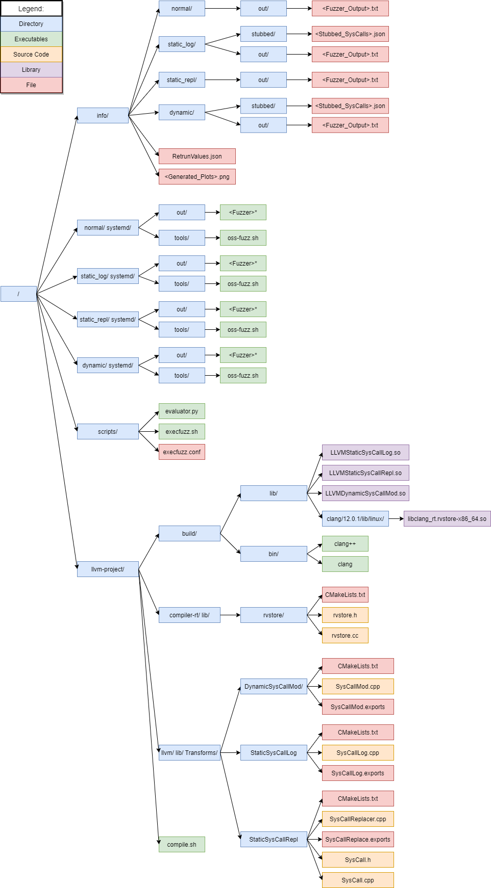
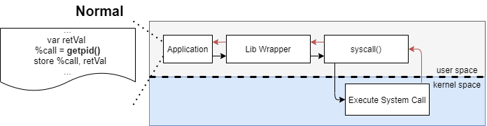
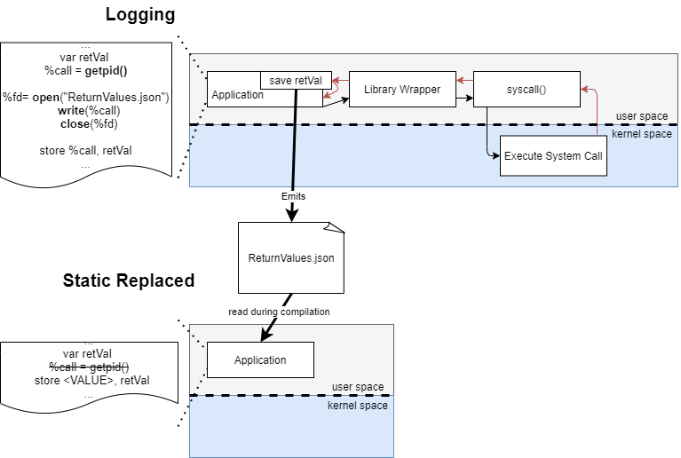
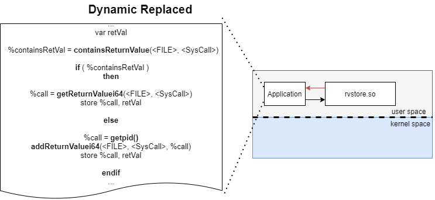

# Design and Evaluation of Automatically Stubbed System Calls Improving Coverage-Guided Fuzzing

A fuzzing optimization project.

## 1. Prerequisite

In order to run the project in a docker container you should have a current version of docker installed.

## 2. Usage

You can start the whole piplien by runing the following command.
It is posible to change the execution time of each fuzzer by changing the value of the variable "$EXECUTION_TIME" in the Dockerfile.

```bash
docker build -f </path/to/pp_hager>/Dockerfile -t <name>_fuzz_test </path/to/pp_hager> [&> ./result/dock_out.log]
```

The following command starts a bash in the previously created container.

```bash
docker run -it <name>_fuzz_test bash
```

## 3. Implementation



### 3.1 Info

The directories "normal/", "static_log/", "static_repl/" and "dynamic/" contains the output of the fuzzer in the "out/" folder and the replaced systemcalls in the "stubbed/" folder.
The file "ReturnValues.json" contains all system call return values of the static aproach.

### 3.2 Fuzzer

The directories "/normal/", "/static_log/", "/static_repl/" and "/dynamic/" contains the copy of the systemd project. Each is compiled with it's secific LLVM-Compiler-Path:

- /normal:      with no pass
- /static_log:  with LLVMStaticSysCallLog
- /static_repl: with LLVMStaticSysCallRepl
- /dynamic:     with LLVMDynamicSysCallMod

These executabes are stored in the "out/" folder.
The "tools/" folder contains the build script "oss-fuzz.sh". This script can be used to build the fuzzers.

Manual fuzzer build:

static log:

```bash
CXX="/llvm-project/build/bin/clang++ -Xclang -load -Xclang /llvm-project/build/lib/LLVMStaticSysCallLog.so" CC="/llvm-project/build/bin/clang -Xclang -load -Xclang /llvm-project/build/lib/LLVMStaticSysCallLog.so" ./tools/oss-fuzz.sh
```

static replaced:

```bash
CXX="/llvm-project/build/bin/clang++ -Xclang -load -Xclang /llvm-project/build/lib/LLVMStaticSysCallRepl.so" CC="/llvm-project/build/bin/clang -Xclang -load -Xclang /llvm-project/build/lib/LLVMStaticSysCallRepl.so" ./tools/oss-fuzz.sh
```

dynamic:

```bash
LDFLAGS="-g /llvm-project/build/lib/clang/12.0.1/lib/linux/libclang_rt.rvstore-x86_64.so -Wl,-rpath,/llvm-project/build/lib/clang/12.0.1/lib/linux" CXX="/llvm-project/build/bin/clang++ -Xclang -load -Xclang /llvm-project/build/lib/LLVMDynamicSysCallMod.so" CC="/llvm-project/build/bin/clang -Xclang -load -Xclang /llvm-project/build/lib/LLVMDynamicSysCallMod.so" ./tools/oss-fuzz.sh
```

### 3.3 Scripts

#### 3.3.1 evaluator.py

```text
usage: evaluator.py [-h] [-et EXECUTION_TIME] [-a ABSOLUTE] [-vsl VISUALIZE_STATIC_LOGGING] [-vm VISUALIZE_MEDIAN] [--show_data_points SHOW_DATA_POINTS] PATH

Perforance evaluations of the provided fuzzing logs.

positional arguments:
  PATH                  Path to the folder containing the fuzzing logs.

optional arguments:
  -h, --help            show this help message and exit
  -et EXECUTION_TIME, --execution-time EXECUTION_TIME
                        Execution time the fuzzer in sec.
  -a ABSOLUTE, --absolute ABSOLUTE
                        Decide if you want to evaluate the absolute value of the fuzzing input executions or the exec/s.
  -vsl VISUALIZE_STATIC_LOGGING, --visualize-static-logging VISUALIZE_STATIC_LOGGING
                        Decide if you want visualize the output of the static logging fuzzer run (not recomended due to
                        different execution time).
  -vm VISUALIZE_MEDIAN, --visualize-median VISUALIZE_MEDIAN
                        Decide if you want visualize the median of all fuzzer (not recomended due to different fuzzer).
  --show_data_points SHOW_DATA_POINTS
                        Decide if you want to want to show every data point. WARNING: leeds to a catoic scatter plot.
```

#### 3.3.2 execfuzz.sh

```text
Usage: execfuzz.sh SYSTEMD_PATH LOG_PATH [OPTION]...
Executes all fuzziers from the standard or the specified conf file.

Mandatory argument:
  SYSTEMD_PATH      Path to systemd
  LOG_PATH          Output path

Optional argument:
  -et, --execution-time         Execution time of each fuzzer in seconds. SUFFIX may be 's' for seconds (the default), 'm' for minutes, 'h' for hours or 'd' for days.. (default=60)
  -cf, --configuration-file     Path to the configuration file. (default=/opt/hager/pp_hager/scripts/execfuzz.conf)
  -h, --help                    Display this help and exit.

Report any bugs to Andreas Hager <andreas.hager@aisec.fraunhofer.de>
```

### 3.4 LLVM Project

The llvm-project can be build useing the script compile.sh:

```bash
./compile.sh
```

It builds to the folder "build/".

### 3.5 Normal System Call



### 3.6 Static Approach

The static approach consists of the steps logging and replacement.



The logging LLVM-Compiler-Pass is in the folder "llmv/lib/Transforms/StaticSysCallLog" implemented.

The replacement LLVM-Compiler-Pass is in the folder "llmv/lib/Transforms/StaticSysCallRepl" implemented.

### 3.7 Dynamic Approach



The dynamic systemcall replacer LLVM-Compiler-Pass is in the folder "llmv/lib/Transforms/DynamicSysCallMod" implemented.

The relating rvstore is in the folder "compiler-rt/lib/rvstore" implemented. 

## 4. References

- [LLVM docu](https://llvm.org/docs/index.html)
- [LLVM ProgrammersManual](http://llvm.org/docs/ProgrammersManual.html)
- [LLVM WritingAnLLVMPass](https://llvm.org/docs/WritingAnLLVMPass.html)
- [LLVM Compiler](https://compiler-rt.llvm.org/)
- [LibFuzzer](https://llvm.org/docs/LibFuzzer.html)
- [Docker](https://www.docker.com/)
- [AISEC mesh-llvm-project](https://github.com/Fraunhofer-AISEC/mesh-llvm-project)
- [Bachelor Thesis fuzzing optimization Axel Strodel](https://git.aisec.fraunhofer.de/projects/BAS/repos/ba_fuzzing_optimization/browse)
- [Drawio (diagrams)](https://drawio-app.com/)
